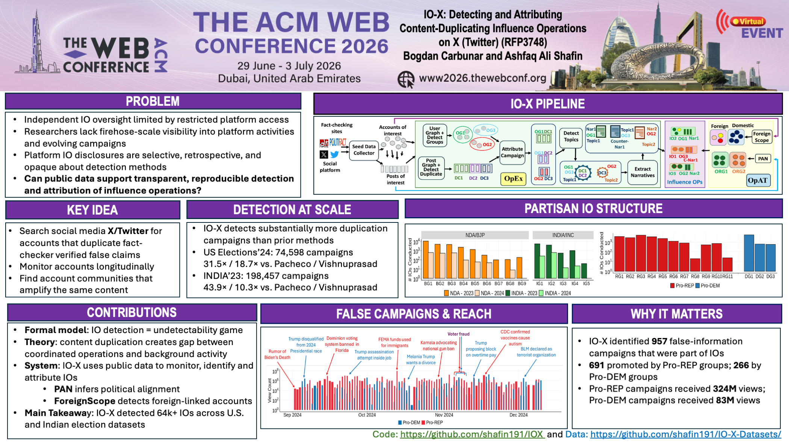

# IOX Codebase

## Overview

The **IOX** codebase. Each component of IOX codes are stored in the directories with the component name.


## 📌 IO-X Poster




## Directory Structure

The codebase is organized into directories based on different components. Below is a high-level overview of the directory structure:

- **Data Collection and Monitor**: Contains notebooks to scrape AltNews/PolitiX misinformation reports, tweets, tweet information, and user information.
- **OpEx**: Code for embedding generation and detecing duplicate tweets, topics, narratives, and IOS.
- **OpAT**: Code for ForeignScope and PAN
- **Miscellaneous (Analysis)**: Code for analyzing accounts, contnet, feature extraction, etc. 


## Requirements

To run **IOX**, you will need the following software and libraries:

### Python Version
- Python >= 3.9

### Key Libraries
- **PyTorch** >= 2.0.0
- **Torchvision** >= 0.15.0

We recommend using **Conda** to install these dependencies as it ensures compatibility across all libraries and makes environment management easier.

### Additional Packages

The required Python packages can be found in requirements.txt and can be installed using `pip` or `conda`:


You can install these dependencies using `pip` or `conda`. For example:

```bash
conda install pytorch>=2.0.0 torchvision>=0.15.0
pip install -r requirements.txt
```


### 📜 Citation

If you use code in your research, please cite the following paper:

```bibtex
@inproceedings{SSC26,
  author    = {Shafin, Ashfaq Ali and Siddique, Md Nahid and Carbunar, Bogdan},
  title     = {IO-X: Detecting and Attributing Content-Duplicating Influence Operations on X (Twitter)},
  year      = {2026},
  isbn      = {979-8-4007-2307-0},
  publisher = {Association for Computing Machinery},
  address   = {New York, NY, USA},
  url       = {[https://doi.org/10.1145/3774904.3792666](https://doi.org/10.1145/3774904.3792666)},
  doi       = {10.1145/3774904.3792666},
  booktitle = {Proceedings of the ACM Web Conference 2026},
  numpages  = {10},
  location  = {Dubai, United Arab Emirates},
  series    = {WWW '26}
}
```

### 📄 License
This codebase is licensed under a [Creative Commons Attribution-NonCommercial-NoDerivatives 4.0 International License (CC BY-NC-ND 4.0)](https://creativecommons.org/licenses/by-nc-nd/4.0/).

